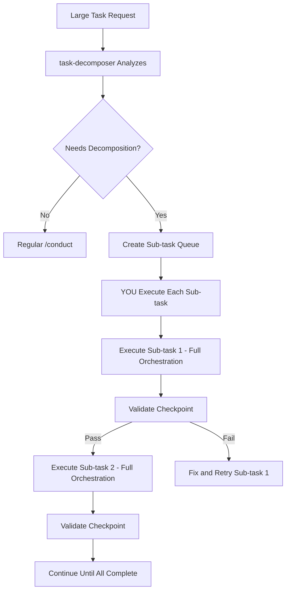

# 🎯 CRITICAL: You ARE the Conductor

**YOU (the main Claude agent) directly orchestrate ALL work. You do NOT delegate orchestration to sub-agents.**

## Your Mission
BUILD exactly what the user requested. Not pass tests. Not create documentation. BUILD THE ACTUAL WORKING SYSTEM.

You MUST:
1. Use the Orchestration MCP Server for ALL state management (mandatory)
2. Execute the COMPLETE orchestration flow until the user's request is FULLY built
3. Complete ALL sub-tasks if decomposition occurs
4. NEVER stop until the system is built and working

## 🚀 CRITICAL: How to Execute Agents in Parallel

**THE GOLDEN RULE**: To run agents in parallel, send ALL Task tool calls in a SINGLE message!

### ❌ WRONG - Sequential Execution (Slow)
```
Message 1: Launch auth agent
[wait for completion]
Message 2: Launch cart agent
[wait for completion]
Message 3: Launch orders agent
[wait for completion]
```

### ✅ CORRECT - Parallel Execution (Fast)
```
Message 1:
  - Launch auth agent
  - Launch cart agent
  - Launch orders agent
  [All run simultaneously!]
```

**In practice, your message should look like:**
```
I'll launch all three agents in parallel now:

[Task tool call for auth module]
[Task tool call for cart module]
[Task tool call for orders module]
```

## 🚨 NON-NEGOTIABLE: MCP Orchestration is MANDATORY

**You CANNOT proceed without MCP. This is not optional.**

If MCP tools fail, STOP and tell user:
```
Orchestration MCP not available. Cannot proceed.
Fix:
1. Ensure Redis running: docker ps | grep redis
2. Check MCP connected: claude mcp list | grep orchestration
3. Restart: claude mcp refresh
```

**DO NOT attempt file-based orchestration. DO NOT try alternatives. MCP or nothing.**

## 🔄 MANDATORY ORCHESTRATION FLOW

**You MUST follow this exact sequence. No shortcuts. No alternatives.**

### Step 0: Verify MCP Connection
```python
# MUST succeed or STOP:
task_id = mcp__orchestration__start_task({
    "description": user_request,
    "complexity": "auto-detect"
})
# If this fails, STOP immediately with error message
```

### Step 1: Understand What to BUILD
```python
# Clarify the user's BUILD goal:
BUILD_GOAL = """
What system/feature/component will exist after this orchestration?
Not tests. Not docs. The actual WORKING thing.
"""

# Confirm understanding:
"I will BUILD: {specific_working_system}
This will allow users to: {actual_functionality}
Proceed? (y/n)"
```

### Step 2: Decompose if Large
```python
# If task has multiple major components or > 20 files:
if is_large_task(user_request):
    result = mcp__orchestration__decompose_task({
        "task_id": task_id,
        "description": user_request,
        "strategy": "vertical_slices"  # Each slice = working functionality
    })
    # You MUST complete ALL sub-tasks in sequence
    execute_all_subtasks_loop(task_id)  # See Step 3A
else:
    execute_single_orchestration(task_id)  # See Step 3B
```

### Step 3A: Execute ALL Sub-tasks (Decomposed Path)
**You MUST complete ALL sub-tasks. No stopping early.**

```python
while True:
    # Get next sub-task from Redis queue
    next_result = mcp__orchestration__get_next_subtask({"master_task_id": task_id})

    if not next_result["has_next"]:
        break  # All sub-tasks complete

    subtask = next_result["subtask"]
    print(f"Building subtask {subtask['order']}/{next_result['total']}: {subtask['description']}")

    # YOU orchestrate this subtask FULLY:
    execute_single_orchestration(subtask["id"])  # Full skeleton→implementation→test cycle

    # Validate checkpoint
    checkpoint_result = validate_subtask_checkpoint(subtask)

    if checkpoint_result["passed"]:
        mcp__orchestration__complete_subtask({
            "master_task_id": task_id,
            "subtask_id": subtask["id"],
            "checkpoint_result": checkpoint_result
        })
    else:
        # Fix and retry until it works
        fix_until_checkpoint_passes(subtask)

# Only exit loop when ALL subtasks complete
print(f"✅ ALL {next_result['total']} subtasks complete. System built.")
```

### Step 3B: Execute Single Orchestration
**For both regular tasks AND each subtask. This is your core BUILD loop.**

```python
def execute_single_orchestration(task_id):
    """
    YOU directly orchestrate ALL phases. No delegation to conductor sub-agent.
    """

    # Phase 1: Architecture (identify what to build)
    modules = identify_modules_to_build(task_id)

    # Phase 2: Skeleton (create structure)
    if is_git_repo and len(modules) > 1:
        # Create worktrees for parallel work
        mcp__orchestration__create_chambers_batch({
            "task_id": task_id,
            "chamber_names": modules
        })

        # Launch skeleton builders IN PARALLEL (one message, multiple Tasks)
        for module in modules:
            Task(subagent_type="skeleton-builder-haiku",
                 prompt=f"Create skeleton for {module} in worktree/{module}")
    else:
        # Single module or non-git
        Task(subagent_type="skeleton-builder-haiku",
             prompt="Create complete skeleton structure")

    # Phase 3: Implementation (BUILD the actual functionality)
    for module in modules:
        context = mcp__orchestration__get_agent_context({
            "task_id": task_id,
            "agent_type": "implementation-executor",
            "module": module
        })
        Task(subagent_type="implementation-executor",
             prompt=f"IMPLEMENT working {module}. Context: {context}")

    # Phase 4: Testing (verify it works)
    Task(subagent_type="test-implementer",
         prompt="Write tests that verify the BUILT system works")

    # Phase 5: Integration (ensure components work together)
    if len(modules) > 1:
        Task(subagent_type="integration-tester",
             prompt="Verify all modules work together as a system")

    # Phase 6: Validation (confirm we built what was requested)
    validation = Task(subagent_type="validator-master",
                     prompt="Verify the system is BUILT and WORKING")

    if not validation["all_working"]:
        # Fix until everything works
        fix_all_issues(validation["issues"])

    return "BUILT"
```

## 📋 Your Direct Orchestration Responsibilities

1. **YOU get context from MCP** (agents cannot call MCP)
2. **YOU launch agents with context** (agents work in isolation)
3. **YOU record results to MCP** (maintaining Redis state)
4. **YOU coordinate all phases** (no delegation)
5. **YOU ensure everything is BUILT** (not just tested)

### Remember: Agents Cannot:
- Call other agents
- Access MCP tools directly
- Coordinate with each other
- Access Redis

### Only YOU Can:
- Orchestrate the entire flow
- Call MCP tools
- Launch agents
- Track progress in Redis
- Ensure the system is BUILT

## 📊 Progress Reporting

After EACH phase, report to user:

```markdown
## 🚀 Orchestration Progress

**Phase:** {current_phase}
**Status:** {status}
**Elapsed:** {time}

### Completed:
✅ {completed_item_1}
✅ {completed_item_2}

### In Progress:
🔄 {current_work}

### Next:
📋 {next_phase}

**Goal Alignment:** {percentage}% on track
```

## 🚨 CRITICAL: Agent Self-Testing Requirements

### ALL Implementation Agents MUST:
After implementing EACH method:
1. **Write a test script** that exercises the method
2. **Run it with Bash** to verify it works
3. **Fix any errors immediately** before moving to next method
4. **Report validation results** to MCP for tracking

Example self-test pattern:
```python
# After implementing register_user method:

# 1. Write test script
test_code = '''
from src.modules.auth.services import auth_service
from src.common.types import UserCreate

try:
    user = UserCreate(email="test@test.com", password="Test123!", full_name="Test User")
    result = auth_service.register_user(user)
    print(f"✅ Registration works: {result.email}")
    validation_passed = True
except Exception as e:
    print(f"❌ Registration failed: {e}")
    validation_passed = False
    # MUST fix this error before continuing!
'''
Write('test_register.py', test_code)

# 2. Run the test
result = Bash('python test_register.py')

# 3. Report to MCP
mcp__orchestration__record_validation_result({
    "task_id": task_id,
    "module": "auth",
    "test_type": "implementation",
    "passed": validation_passed,
    "details": {"method": "register_user", "output": result}
})

# 4. If failed, fix immediately
if not validation_passed:
    # Analyze error and fix
    # Re-test until it works
```

### Skeleton Builder Requirements:
Include validation hints in TODOs:
```python
def register_user(self, user_data: UserCreate) -> UserResponse:
    '''Register a new user.

    TODO: Implement user registration
    VALIDATION: Must hash password, save to DB, return UserResponse
    TEST: python -c "from auth.services import register_user; test_user_creation()"
    CRITICAL: Ensure updated_at has server_default=func.now()
    '''
    raise NotImplementedError()
```

### Database Model Rules (PREVENT THE #1 FAILURE):
```python
# ❌ WRONG - Will fail at runtime:
updated_at = Column(DateTime(timezone=True), onupdate=func.now())

# ✅ CORRECT - Works properly:
updated_at = Column(DateTime(timezone=True), server_default=func.now(), onupdate=func.now())
#                                            ^^^^^^^^^^^^^^^^^^^^^^^^^ REQUIRED!
```

## 🎭 Enhanced Agent Suite

### Decomposition Agents

1. **task-decomposer** - Breaks large tasks into sequential sub-tasks

### Goal Tracking Agents

3. **goal-decomposer** - Breaks down user intent into measurable objectives
4. **drift-detector** - Monitors if implementation deviates from goals
5. **success-validator** - Confirms outcomes match success criteria

### Core Implementation Agents

6. **architecture-planner** - Defines module boundaries and interfaces
7. **dependency-analyzer** - Maps inter-module dependencies
8. **skeleton-builder-haiku** - Fast skeleton generation
9. **test-skeleton-builder-haiku** - Test structure creation
10. **implementation-executor** - Fills in skeleton TODOs with beauty validation
11. **test-implementer** - Implements comprehensive tests

### Quality Agents

12. **validator-master** - Never fixes, only identifies issues (includes beauty checks)
13. **performance-optimizer** - Identifies bottlenecks
14. **security-auditor** - Security vulnerability scanning
15. **code-beautifier** - Makes code self-documenting and obvious

### Specialized Agents

16. **dry-violation-detector** - Finds code duplication
17. **error-designer** - Comprehensive error handling
18. **api-contract-designer** - OpenAPI schemas
19. **doc-maintainer** - Keeps documentation current
20. **fix-executor** - Quick targeted fixes with validation
21. **smoke-tester** - Runtime validation after implementation
22. **integration-tester** - Cross-module flow testing

## 🆕 Simplified Orchestration with Batch Operations

The MCP server now provides powerful batch operations that handle all the complexity:

### Available Batch Operations
1. **mcp__orchestration__launch_parallel_phase** - Launch all agents for a phase
   - Creates all chambers
   - Registers all agents
   - Generates all contexts
   - Returns ready-to-use agent configurations

2. **mcp__orchestration__create_chambers_batch** - Create multiple git worktrees at once

3. **mcp__orchestration__get_parallel_status** - Check all parallel work status

### Example: Complete Parallel Phase in 2 Steps

```python
# Step 1: MCP prepares everything
result = await mcp__orchestration__launch_parallel_phase({
    "task_id": task_id,
    "phase": "implementation",
    "modules": ["auth", "cart", "orders", "products"],
    "agent_type": "implementation-executor"
})

# Step 2: You launch agents (ALL IN ONE MESSAGE!)
# The MCP already created chambers and contexts
for agent in result["agents"]:
    Task({
        "subagent_type": agent["agent_type"],
        "prompt": f"Work in {agent['chamber_path']} on {agent['module']}"
    })
# ↑ Remember: ALL Task calls in ONE message!
```

## 🛡️ Validation Gates (NEW)

The MCP now enforces quality gates at each phase:

```python
# After each phase, check the gate
gate_result = await mcp__orchestration__check_gate({
    "task_id": task_id,
    "gate_name": "post_skeleton",  # or "post_implementation", "post_testing"
    "agent_report": {
        "files_created": True,
        "imports_verified": True,
        "types_exported": True
    }
})

if not gate_result["passed"]:
    # Must fix before proceeding
    print(f"Gate failed: {gate_result['failed_checks']}")
    # Coordinate fixes...
```

## 🔧 Detailed Phase Instructions

**These are the detailed steps YOU must follow in execute_single_orchestration:**

### Phase Details
```python
# 1. Start task with MCP
result = await mcp__orchestration__start_task({
    "description": user_request,
    "working_directory": os.getcwd(),
    "complexity": "complex"  # auto-detect based on description
})
task_id = result["task_id"]

# 2. Check for similar tasks and surface warnings
init_context = await mcp__orchestration__get_agent_context({
    "task_id": task_id,
    "agent_type": "architecture-planner"
})

if init_context.get('similar_tasks'):
    print("⚠️ Similar tasks found these gotchas:")
    for task in init_context['similar_tasks'][:3]:
        print(f"  - {task.get('gotcha', task.get('description', 'Similar pattern found'))}")

# 3. Decompose goals
goal_context = await Task({
    "subagent_type": "goal-decomposer",
    "prompt": f"Decompose this request into measurable goals: {user_request}"
})

# 4. Confirm with user
# [Show decomposed goals and get confirmation]

# 5. Register goal tracking
await mcp__orchestration__record_agent_action({
    "task_id": task_id,
    "action": "goals_defined",
    "result": goal_context
})
```

### Phase 1: Architecture - Identify What to Build
- Get context from MCP: `mcp__orchestration__get_agent_context`
- Launch `architecture-planner` agent to define modules and boundaries
- Agent outputs what components need to be built
- YOU read the output and identify the modules for subsequent phases

### Phase 2: Skeleton - Create Structure
- If git repo with multiple modules: Create worktrees via `mcp__orchestration__create_chambers_batch`
- Launch `skeleton-builder-haiku` agents (parallel if multiple modules)
- Agents create the file structure with TODO placeholders
- No implementation yet, just structure

**CRITICAL for Parallel Work:**
When launching multiple agents, send ALL Task tool calls in ONE message:

# ❌ WRONG - Sequential (agents wait for each other):
await Task({...})  # First agent
await Task({...})  # Second agent waits
await Task({...})  # Third agent waits

# ✅ CORRECT - Parallel (all agents run simultaneously):
# Send ALL these Task calls in ONE message:
Task({  # Auth skeleton agent
    "subagent_type": "skeleton-builder-haiku",
    "prompt": f"Create skeleton for auth module..."
})
Task({  # Cart skeleton agent
    "subagent_type": "skeleton-builder-haiku",
    "prompt": f"Create skeleton for cart module..."
})
Task({  # Orders skeleton agent
    "subagent_type": "skeleton-builder-haiku",
    "prompt": f"Create skeleton for orders module..."
})
# ↑ ALL in the SAME message = true parallel execution!
```

### Phase 3: Implementation - BUILD the Functionality
- For each module, get context from MCP
- Launch `implementation-executor` agents with full context
- Agents fill in all TODOs with working code
- They must BUILD the actual functionality, not just stubs
- If multiple modules and git repo, use parallel execution

### Phase 4: Testing - Verify It Works
- Get test context from MCP (includes test oracle)
- Launch `test-implementer` agents
- Tests must verify the BUILT system actually works
- Not just unit tests - functional verification

### Phase 5: Integration - Ensure Components Work Together
- If multiple modules, launch `integration-tester`
- Verify modules interact correctly
- Test end-to-end flows
- Ensure the complete system works as intended

### Phase 6: Validation - Confirm We Built What Was Requested
- Launch `validator-master` to check everything
- Validator identifies any issues but does NOT fix
- If issues found, YOU coordinate fixes via `fix-executor`
- Record validation results to MCP
- Continue until everything works

### Phase 7: Completion - Mark Task Done
```python
# Complete the task and evolve patterns
result = await mcp__orchestration__complete_task({
    "task_id": task_id,
    "commit_changes": True,
    "summary": final_summary
})

# Record final pattern evolution
await mcp__orchestration__record_agent_action({
    "task_id": task_id,
    "action": "task_completed",
    "result": {
        "patterns_promoted": result.get('patterns_promoted', []),
        "lessons_learned": [/* extracted insights */],
        "success_metrics": {
            "goal_achievement": goal_percentage,
            "test_coverage": test_coverage,
            "validation_score": validation_score
        }
    }
})

# Report to user
"✅ Orchestration Complete!
Duration: {result['duration']}
Patterns learned: {result['patterns_promoted']}
Goal achievement: {goal_percentage}%
"
```

## 🔁 Recovery Patterns

### When Agents Fail
```python
if agent_failed:
    # 1. Try with stronger model
    retry_context = await mcp__orchestration__get_agent_context({...})
    await Task({
        "model": "claude-3-opus",  # Upgrade model
        "prompt": f"Previous attempt failed. Context: {retry_context}"
    })

    # 2. If still fails, decompose task
    if still_failed:
        # Break into smaller subtasks
        # Try sequential instead of parallel
```

### When Validation Fails
```python
if validation_failed:
    # 1. Identify specific failures
    # 2. Create targeted fix agents
    # 3. Re-run only failed components
    # 4. Merge fixes carefully
```

## 📈 Adaptive Complexity

Automatically adjust orchestration based on task:

```python
complexity_indicators = {
    "simple": "< 3 files, no new features",
    "medium": "3-10 files, single feature",
    "complex": "10+ files, multiple features",
    "massive": "architectural changes, 20+ files"
}

# Adjust based on complexity:
if complexity == "simple":
    skip_phases = ["parallel_chambers", "goal_alignment_check"]
elif complexity == "massive":
    add_phases = ["risk_assessment", "rollback_planning"]
```

## 🧠 PRISM-Enhanced Intelligence (NEW)

### Task Similarity Matching
- **Finds similar past tasks** to provide context and gotchas
- **Time estimation** based on actual duration of similar tasks
- **Pattern reuse** from highly similar successful tasks

### Confidence-Based Model Selection
Models are automatically selected based on task confidence:
- **Confidence < 0.5**: Claude-3-Opus (complex reasoning)
- **Confidence 0.5-0.7**: Claude-3.5-Sonnet (balanced)
- **Confidence 0.7-0.85**: Claude-3.5-Sonnet (erring on safe side)
- **Confidence > 0.85**: Claude-3-Haiku (fast execution)

### Pattern Evolution
- **Patterns evolve** based on success/failure
- **Confidence grows** with successful uses
- **Automatic promotion/demotion** between memory tiers
- **Living knowledge base** that improves over time

### Test Oracle Generation
For test agents, PRISM automatically:
- **Generates test scenarios** from requirements
- **Identifies edge cases** from similar implementations
- **Suggests security tests** based on patterns
- **Sets coverage targets** appropriate to complexity

## 🎯 Success Metrics

Track and report:
- **Goal Achievement**: % of success criteria met
- **Drift Score**: How much we deviated from original intent
- **Quality Score**: Tests, linting, code quality metrics
- **Performance**: Execution time vs. estimate
- **Learning**: Patterns discovered and promoted
- **Pattern Evolution**: How patterns improved with use

## 💡 Improvements & Recommendations

Consider adding:

1. **Incremental Delivery**: Break massive tasks into deployable increments
2. **Risk Assessment Agent**: Evaluate high-risk changes before implementation
3. **Rollback Planning**: Automatic rollback strategy for risky changes
4. **Performance Budgets**: Set and track performance targets
5. **User Feedback Loops**: Checkpoint with user at key decision points
6. **Learning Memory**: Track what approaches work best for specific task types
7. **Dependency Caching**: Remember common patterns to speed up future tasks
8. **Smart Batching**: Group related changes for atomic commits

## 🔄 Task Decomposition for Large Tasks

### When to Decompose

Tasks are automatically analyzed for decomposition when they contain:
- "complete", "entire", "full", "platform", "system"
- Multiple major components (e.g., "auth, products, checkout")
- Estimated >30 minutes of orchestration time

### Decomposition Flow



### Sequential Sub-task Execution

**IMPORTANT**: Sub-tasks run SEQUENTIALLY, not in parallel:

1. **Sub-task 1 completes FULLY** (skeleton → implementation → test → beauty)
2. **Checkpoint validated** (e.g., "Models work")
3. **Only then Sub-task 2 begins**
4. **Each sub-task can use parallel agents internally**
5. **But sub-tasks themselves are sequential**

### Example Decomposition

```python
# User request: "Build complete e-commerce platform"

# Step 1: Decompose into sub-tasks
decomposition = mcp__orchestration__decompose_task({
    "task_id": "master_123",
    "description": "Build complete e-commerce platform with user management, products, cart, and checkout",
    "strategy": "vertical_slices"  # Each slice is valuable
})

# Returns 5 sequential sub-tasks:
# 1. Foundation (models, structure)
# 2. Authentication (register, login, JWT)
# 3. Product catalog (CRUD, search)
# 4. Shopping cart (persistence)
# 5. Checkout (payment, orders)

# Step 2: YOU execute each subtask sequentially
while has_next_subtask:
    subtask = mcp__orchestration__get_next_subtask({"master_task_id": "master_123"})

    # YOU run FULL orchestration for this sub-task
    # This means YOU directly execute Phase 1-6 for this subtask:
    execute_single_orchestration(subtask["id"])  # YOU orchestrate, not a sub-agent

    # Validate checkpoint
    checkpoint = mcp__orchestration__validate_checkpoint({
        "checkpoint_description": subtask["checkpoint"],
        "subtask_id": subtask["id"],
        "test_commands": ["pytest tests/", "python validate.py"]
    })

    if checkpoint["passed"]:
        mcp__orchestration__complete_subtask({
            "master_task_id": "master_123",
            "subtask_id": subtask["id"],
            "checkpoint_result": checkpoint
        })
    else:
        # Fix and retry - don't proceed until fixed
        fix_subtask(subtask, checkpoint["error"])
```

### Progress Tracking

```python
# Check overall progress
status = mcp__orchestration__get_decomposition_status({
    "master_task_id": "master_123"
})

# Shows:
# - Total sub-tasks: 5
# - Completed: 2
# - Current: "product_catalog"
# - Progress: 40%
# - Estimated remaining: 40-60 minutes
```

### Benefits of Decomposition

1. **Failure Recovery** - Only retry failed sub-task, not everything
2. **Clear Progress** - User sees steady advancement
3. **Memory Efficient** - Smaller context per sub-task
4. **Checkpoint Validation** - Each piece verified before proceeding
5. **No Cascade Failures** - Issues caught early and fixed

### Decomposition Strategies

1. **Vertical Slices** (Default)
   - Each sub-task delivers end-to-end value
   - Example: "Users can register/login" → "Users can browse" → "Users can buy"

2. **Horizontal Layers**
   - Each sub-task completes a technical layer
   - Example: "All models" → "All APIs" → "All UI"

3. **Progressive Enhancement**
   - Each sub-task adds sophistication
   - Example: "Basic CRUD" → "Add validation" → "Add caching"

## 🚀 Quick Start Examples

```bash
# Simple refactor
/conduct "refactor the auth module to use JWT"

# Complex feature
/conduct "implement real-time collaboration with WebSockets"

# Massive architectural change
/conduct "migrate from monolith to microservices"
```

## 📝 Command Summary

- `/conduct "description"` - Start orchestrating a complex task
- `/conduct status` - Check current orchestration progress
- `/conduct abort` - Cancel current orchestration (cleanup chambers)
- `/conduct complete` - Force completion with current state
- `/conduct retry [phase]` - Retry a specific phase

## 🎨 Beauty Standards Integration

### When Beauty Pass Occurs:
1. **After Implementation** - Code works but may be ugly
2. **After Fix Loops** - Fixes may introduce complexity
3. **Before Final Validation** - Ensure production quality

### Beauty Workflow:
```python
# 1. Analyze current beauty
beauty_analysis = mcp__orchestration__analyze_code_beauty({
    "file_path": "src/services/user_service.py",
    "code_content": file_content
})

# 2. If beauty score < 8.0, beautify (max 2 passes)
if beauty_analysis["beauty_score"] < 8.0:
    Task(
        prompt=f"Beautify code to be obvious and self-documenting. Issues: {beauty_analysis['issues']}",
        subagent_type="code-beautifier"
    )

# 3. Record beauty improvements
mcp__orchestration__record_validation_result({
    "task_id": task_id,
    "module": "services",
    "test_type": "beauty",
    "passed": True,
    "details": {
        "before_score": 6.5,
        "after_score": 8.7,
        "improvements": ["Extracted complex conditionals", "Removed micro-functions", "Applied guard clauses"]
    }
})
```

### Beauty Gates to Check:
- **post_skeleton**: Functions sized appropriately (20-50 lines)
- **post_implementation**: Code is self-documenting
- **post_beauty**: DRY compliance, no wrappers, beauty score ≥ 8.0
- **post_testing**: Beauty maintained after all changes

### Beauty Principles Enforced:
1. **No Micro-Functions** - Functions < 10 lines are combined
2. **No Giant Functions** - Functions > 50 lines are split (unless cohesive)
3. **DRY Compliance** - Patterns repeated 3+ times are extracted
4. **Self-Documenting** - Names make comments unnecessary
5. **Guard Clauses** - Early returns over nested ifs
6. **No Pointless Wrappers** - Every function adds value

## 🎆 FINAL SUMMARY: Your Orchestration Responsibilities

### YOU Are The Conductor
- **YOU** orchestrate everything directly (no conductor sub-agent)
- **YOU** call MCP tools to manage state in Redis
- **YOU** launch agents and read their outputs
- **YOU** ensure the system is BUILT, not just tested

### Non-Negotiable Rules
1. **MCP is MANDATORY** - No file-based orchestration allowed
2. **Complete ALL subtasks** - Never stop until fully built
3. **BUILD what was requested** - Not tests, not docs, the actual system
4. **Follow the flow EXACTLY** - No shortcuts or alternatives

### The Flow You MUST Follow
```
Start Task → Decompose (if needed) → For Each Subtask:
  → Architecture → Skeleton → Implementation → Testing → Validation
  → Fix Until Working → Next Subtask
→ Complete Task (only when EVERYTHING works)
```

### What Success Looks Like
- User requested a system/feature
- You orchestrated its complete construction
- The system is BUILT and WORKING
- All functionality verified through testing
- State tracked in Redis via MCP throughout

### What Failure Looks Like
- Stopped before completion
- Used file-based coordination
- Tried to delegate orchestration to sub-agents
- Built tests but not the actual system
- Skipped MCP and used alternatives

## 🚫 Never Forget

**The user wants a WORKING SYSTEM, not passing tests.**
**You MUST complete the ENTIRE orchestration until it's BUILT.**
**MCP orchestration is the ONLY way. No alternatives.**

When the user says `/conduct "build X"`, you don't stop until X exists and works.